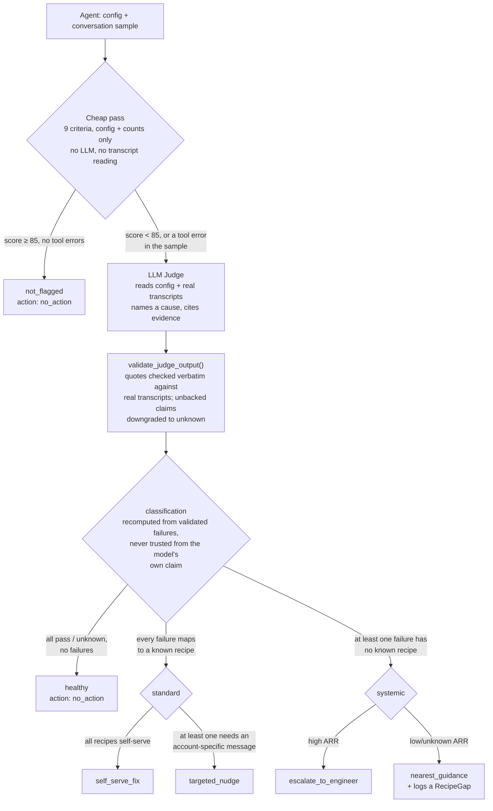

# agent-config-judge

A two-tier detector for misconfigured ElevenLabs conversational voice agents,
built to run against a whole portfolio of accounts, and just as usable
checking one account on demand.

**In one sentence:** this automates the repeatable, mechanical part of what
an Adoption Strategist does across a whole portfolio (`scan`) and what an
FDE/Deployment Strategist does for one account someone is asking about
right now (`evaluate`) — detect a concern, confirm it with cited evidence,
and recommend an action — while leaving explicitly to a human everything
that still needs real judgment: a failure mode outside what this tool was
built to check for (see "Limitations"), an ambiguous call, and any actual
change to a customer's live agent.

**Why this exists:** I built this to demonstrate, end to end, the exact work
an adoption/deployment-facing role at ElevenLabs actually does — proactively
auditing customer agents' prompts, configs, and tool setup to find gaps at
scale, instead of reviewing accounts one at a time by hand. The two-tier
design (a free mechanical pass on every agent, an LLM read only for whatever
that flags) is the concrete answer to "how do you audit a high-volume book
without it becoming bespoke, manual work per account" — and the eval harness
below exists so the detector's own accuracy is a measured number, not a
claim. See "Path to scale" and the live dashboard's "Does this scale?" tab
for the honest version of what's real production-ready today versus still a
plan.

## The problem this exists to solve

A misconfigured voice agent usually looks fine. It answers calls, it doesn't
crash, and every config checkbox is ticked. The only way to find out it's
actually broken is to read what happened when a real user hit the specific
edge the config silently fails on — and nobody reads every transcript across
hundreds of accounts.

This repo is a working answer to that, built as a case study against my own
ElevenLabs workspace, not synthetic examples pretending to be one. Two tiers:

1. **Cheap pass** — proxy signals score every agent in the portfolio. No
   transcripts read, no LLM called. Its only job is deciding who gets read in
   depth. It over-flags on purpose: a false flag costs one judge call; a
   missed broken agent costs a client.
2. **LLM judge** — reads the config *and* the transcripts of whatever got
   flagged, scores nine criteria with cited evidence, names a cause for every
   failure, and maps that cause onto a recipe catalog. A cause with a known
   fix is **standard** (automatable); a cause with no known fix is
   **systemic** (needs a human) — by construction, not by judgment call.

A router then turns (classification × account ARR) into exactly one action.
Detection is 100% automated; anything that would touch a customer's live
agent comes back `requires_human_approval: true`.

## Plain-language summary (no code needed)

If you don't read code, start here — the rest of this document is for
people who want to verify the details; this section is the whole idea.

**The problem, in one sentence:** a voice agent can look completely
fine — it answers, it doesn't crash, every setting is filled in — and
still be broken in a way nobody notices until a real customer runs into
it.

**Why nobody notices:** the only way to catch that kind of break is to
actually read what happened in a real conversation, and nobody has time
to read every conversation across every agent in a whole portfolio of
accounts.

**What this project does about it, in two steps:**

1. **A cheap first pass, over every agent.** A quick, mechanical check
   reads only an agent's settings (never its conversations) and a few
   basic conversation statistics that were already computed elsewhere —
   no AI model involved, closer to a spreadsheet formula than a "smart"
   check. Its only job is deciding which agents deserve a closer look. It
   deliberately flags more agents than strictly necessary: flagging a
   healthy agent by mistake just costs one extra review; missing a
   genuinely broken one costs a real customer.
2. **A careful second look, only for whatever got flagged.** An AI model
   reads that agent's settings and a sample of its real conversations,
   and checks nine specific things that make an agent "healthy" (does it
   have a clear role? does human handoff actually work on the channel it
   runs on? does it leave users frustrated? and so on). Crucially, the
   model's opinion is never taken at face value — a separate, non-AI step
   checks that every claim it makes is backed by something real (a
   verbatim quote from the conversation, or a fact from the settings)
   before trusting it. An unbacked claim is downgraded to "not sure"
   rather than accepted.

**What comes out the other end:** every agent lands in one of three
buckets — completely fine, a "known problem with a known fix" (automatable:
a generic tip, or a message tailored to that account), or "something new
or unusual that needs a person to look at it." A final step decides the
actual next action, factoring in how much revenue that account
represents.

**Where to see this working without reading any code:** the live
dashboard (see "Live dashboard" below) shows every agent's score, its
flags, and — for anything the second step reviewed — exactly which of the
nine checks failed and why, in plain language, with a "how does this
work?" button that walks through the whole process for anyone curious.

## The finding that shaped this design

While pulling real data to build this repo's fixtures, I found this live in
my own workspace, on an agent called **Onboarding Assistant**
(`agent_3701kz9j7j4ffmcbxzdeq0a9h1t0`), running on the `react_sdk` channel.
A user asked to be transferred to a sales rep about pricing. The agent said:

> "Please wait while I connect you with a sales representative who can help
> you with pricing information."

It called `transfer_to_number`. The tool came back:

> `"error":"Transfer to number tool is only available for phone calls
> powered by Twilio, Exotel, or SIP trunking"`

The agent recovered gracefully in speech — "I am sorry, but I am unable to
transfer calls at this moment..." — but the user's actual request (a human,
for a pricing question) was never met. **Every config check on this agent
passes.** `transfer_to_number` is a real, valid, fully-configured tool. The
only place this failure is visible is the transcript, on the exact channel
this agent runs on. This is not a hypothetical from the case study brief —
it's this repo's own portfolio, and it's why the judge tier exists at all:
*a tool being configured is not the same as a tool that works.*

(Full parsed evidence, redacted only for phone numbers, is in
`fixtures/real_portfolio_snapshot.json` / `fixtures/recorded_judgements.json`;
provenance and the raw shapes pulled are in `scripts/build_real_fixture.py`.)

## What else the real portfolio turned up

Five real agents got scanned (see "Running it" below for how to reproduce
this yourself against the bundled fixtures, zero API keys required):

| Agent | Cheap-pass score | Classification | What's actually wrong |
|---|---|---|---|
| Onboarding Assistant | 40.0 (forced) | standard | The case above, plus a system prompt that's just `"Eres un asistente útil"` — long enough to dodge a naive length check, but no bounded role at all |
| No Borders - Intake | 57.8 | standard | System prompt literally says *"ofrecé pasarlo con una persona"* (offer to hand off to a person) if the customer is upset or the case is complex — but **zero transfer tools are configured anywhere**. This one config check alone catches it; no transcript needed |
| No Borders - Operations Copilot | 51.1 (forced) | standard | A webhook tool (`crm_lookup`) returned HTTP 401 twice in the same conversation, and the agent retried the *identical* query verbatim before giving up — the live instance of a cause (`multi_turn_repeats_failed_tool_call`) added to the catalog after finding it here |
| Customer Support Agent | 31.1 | standard | Completely empty: blank system prompt, no tools, no KB, zero conversations ever. A real, unconfigured stub, not a synthetic example |
| Recruiter Agent | 42.2 | **healthy** | Cheap pass flags missing knowledge_base and human_handoff — but this is a one-user internal recruiting roleplay tool with the full job description and candidate CV embedded directly in the prompt. Neither criterion actually applies, and the judge correctly walks the flag back to healthy |

The Recruiter Agent row is the one genuinely interesting non-failure: it's a
live demonstration of the cheap pass's designed-in over-flagging, and of the
judge tier correctly recognizing when a rubric criterion doesn't fit an
agent's real job (a distinction that has nothing to do with "trusting"
config — it comes from actually reading the prompt).

**ARR values used anywhere in this repo are a synthetic annotation for the
router demo**, not real revenue figures — the ElevenLabs Agents API has no
concept of account revenue, so there was nothing real to pull.

**These scores are a frozen snapshot, not a live number.** They're exactly
what `fixtures/real_portfolio_snapshot.json` produces — a fixture captured
at one point in time, kept static on purpose so the CLI demo and the
golden-set eval below stay reproducible run after run. The live dashboard
(next section) re-fetches real, current data on a schedule and will show
different — usually higher, as more real conversation volume accumulates —
scores for the same agents. Neither number is "wrong"; they're answering
different questions: "what did this fixture look like when it was built"
vs. "what does the workspace look like right now."

## Live dashboard

Beyond the fixtures and the CLI, there's a running, browser-viewable
snapshot of this pipeline's tier-1 output against the real workspace:
**[Portfolio Console](https://claude.ai/code/artifact/406d6fcc-733a-47a3-8570-32310b85e4fb)**.
It lives outside this repo's own file tree (it's a published page, not a
committed script), but it's built entirely on the same code above — no
separate scoring logic.

- Every real agent in the workspace gets a card: its cheap-pass score,
  which of the nine criteria passed/failed/unknown (hover any chip for the
  reasoning), and — if the judge has actually reviewed it — its
  classification, named failures, and the router's recommended action. An
  agent the cheap pass never flagged shows a distinct "not flagged" state
  rather than a fabricated "judge confirmed healthy" — the judge tier is
  only ever invoked when `cheap_result.flagged` is true (see
  `pipeline.py`), so showing anything else there would misrepresent what
  the real pipeline actually does.
- Two illustrative demo agents (`DEMO - Healthy Support Agent`,
  `DEMO - Broken Support Agent`) were built specifically for this
  dashboard, side by side, so the same nine criteria can be seen passing
  cleanly on one and failing in several different ways on the other —
  real agents, real simulated conversations, scored by this exact
  codebase, not hand-waved.
- A scheduled routine refreshes the tier-1 numbers once a day: it
  re-fetches every agent's current config and a conversation sample,
  re-scores it with `cheap_pass.score_agent`, and diffs the workspace's
  current roster against what the dashboard already tracked — a
  newly-created agent gets added (shown "not yet judged" until tier 2
  actually reviews it), and an agent removed from the workspace gets a
  one-cycle notice before dropping out entirely. **The judge tier is never
  re-invoked automatically by this refresh**, even when a cheap-pass score
  changes a lot — flagged instead as a candidate for a human to send back
  through tier 2, consistent with "detection is 100% automated, anything
  that touches a live decision needs a human" above.
- The dashboard has its own in-page FAQ button (top right) with three
  tabs — one walking through all nine cheap-pass criteria, one walking
  through the judge's full step-by-step flow (which function does what,
  what goes in, what comes out), and one honestly answering "does this
  scale?" (✓ what's real code today vs. ○ what's still a plan, kept in
  sync with "Path to scale" below) — entirely in plain language, no code
  shown. It's a shorter, visual companion to this README for anyone who'd
  rather click through than read source.
- A filter bar above the agent grid narrows the view by free-text search
  (agent name or `agent_id`) and by classification (unjudged / not
  flagged / healthy / standard / systemic) — purely client-side, filtering
  what's already tracked here. Deliberately *not* "look up any agent
  live" (that's the `evaluate` CLI command above, or the future button
  described in "Path to scale" — both need either a live API key on your
  own machine or a real backend this dashboard doesn't have); this is the
  free half: search within what this portfolio already scanned.

## Architecture

**The daily production flow this is built for** (still the plan today — see
"Path to scale" and "Calibration backlog" — not an active schedule): the
cheap pass runs over the whole portfolio every day, free, no exceptions. Of
whatever it flags, an agent whose config *and* sampled conversations are
byte-identical to the last time it was judged reuses that cached verdict —
no new judge call, no new cost. A brand-new agent, one whose config
changed, or one whose conversation sample picked up anything new since
last time gets a fresh judge call, and the cache updates for next time. An
agent the cheap pass doesn't flag never reaches this question at all — the
cache and the judge are invisible to it.

The mechanism itself — what actually happens to one agent, end to end:



**A quick reference for what "Validate" and "Classify" above actually do with
each criterion's verdict, cause, and evidence, per criterion:**

- **Evidence doesn't survive verification** (fabricated quote, or no quote/config
  field at all) → verdict downgraded to `unknown` — doesn't reach the cause_code
  check below at all, and doesn't count as a failure.
- **Evidence is real, verdict stays `fail`, but the cause doesn't map cleanly** —
  three distinct ways this happens: no `cause_code` given; a `cause_code` that
  doesn't exist in `rubric.RECIPE_CATALOG`; or one that exists but is filed
  under a *different* criterion than the one that failed. All three land the
  same way: that failure keeps its `fail` verdict but gets no recipe
  (`recipe = None`) — which alone is enough to push the *whole agent* to
  `systemic`, regardless of how many other failures on it do have a known fix.
- **Evidence is real, verdict stays `fail`, and the cause_code is correctly
  catalogued under its own criterion** → the recipe is trusted, and this
  failure counts toward `standard`.

And which file owns which piece of that:

```
agent_config_judge/
  rubric.py             nine criteria (data) + the recipe catalog (the standard/systemic boundary)
  models.py             AgentConfigSnapshot / AggregateMetrics / ConversationRecord — see below
  cheap_pass.py          tier 1: proxy scorer over config + aggregate metrics only
  judge.py               tier 2: prompt, strict JSON contract, evidence-enforcing validator
  judge_cache.py         skips a real judge call when nothing it would read has changed
                         since the last cached run for that agent_id (opt-in, --judge-cache)
  judge_ensemble.py      re-confirms a "no failures found" read before trusting it (opt-in,
                         --ensemble-max-extra-runs) — see "A third judge backend" below
  router.py              classification x ARR -> exactly one action
  elevenlabs_client.py   real Agents API client + mechanical metrics derivation
  pipeline.py            wires the three tiers together
  cli.py                 `agentjudge scan|evaluate|fetch-portfolio|demo|show-recipe`
eval/
  golden_set.py          19 labeled cases: 5 real + 14 synthetic (2 required false-positive traps + more)
  run_eval.py             the harness — three separate scorecards, see "Eval results"
fixtures/
  real_portfolio_snapshot.json   the 5 real agents above, phone numbers redacted, everything else as it came
  recorded_judgements.json        genuine judge output for all 19 golden-set cases (see below)
scripts/
  build_real_fixture.py            provenance: how the real fixture was built from raw API shapes
  produce_recorded_judgements.py    provenance: how the recorded judgements were produced
  calibrate_latency_bands.py        reports observed TTFB percentiles per channel from a snapshot;
                                     never auto-applies them (see "Limitations")
  redact_snapshot.py                strips real system prompts, tool endpoints, and conversation
                                     text from a fetched snapshot before it's ever committed anywhere
tests/                            63 tests on the load-bearing contract rules (see "Running the tests")
```

### The nine criteria

Three are checkable from config alone; six only show up in transcripts —
config can pass all three and the agent can still be broken (see the finding
above).

| Criterion | Source | What "healthy" looks like |
|---|---|---|
| `system_prompt` | config | Clear, bounded role with explicit limits. A prompt that exists but contradicts itself is FAIL, not PASS |
| `knowledge_base` | config | At least one source connected, if the job needs one |
| `human_handoff` | config | A transfer path that **works on the channels this agent actually runs on** |
| `fallback` | behavior | Says it doesn't know, *then* escalates — in that order |
| `grounding` | behavior | Specific claims (numbers, limits, prices, policies) are attributable; conversational filler needs no source |
| `multi_turn` | behavior | Holds context; doesn't re-ask what it already has, doesn't loop on edge cases |
| `escalation_health` | behavior | Neither zero nor runaway |
| `sentiment` | behavior | No frustration *caused by the agent* — a user angry about something unrelated isn't a failure |
| `latency` | behavior | Within band for the channel; slow turns get a shared-cause note when one exists |

### Cheap pass, criterion by criterion: what, how, and why it's cheap

The table above says *what* each criterion checks. This one says exactly
*how* — what field or count it reads, what makes it PASS/FAIL/UNKNOWN, and
why that check qualifies as "cheap" (no LLM call, no semantic reading, just
counting/regex/exact-match over data ElevenLabs already returns).

| Criterion | What it measures | How it's measured | PASS / FAIL / UNKNOWN | Why it's cheap |
|---|---|---|---|---|
| `system_prompt` | Whether the agent has a prompt substantial enough to express a bounded role | Character length of `config.system_prompt`, stripped, against a fixed floor (40 chars) | FAIL if under the floor; PASS if at or above it. Never UNKNOWN — the field is always readable | A `len()` check on a config field already in the API response |
| `knowledge_base` | Whether the agent has at least one connected knowledge source | Count of `config.knowledge_base_ids` | UNKNOWN if zero (config alone can't say the job needs one); PASS if one or more. Never FAIL — absence isn't proof of a problem | Counting an array already in the config |
| `human_handoff` | Whether a human-transfer path exists **and works on the channels this agent actually runs on** | `transfer_to_agent`/`transfer_to_number` tool presence, cross-checked against `channels_seen` (from `metadata.conversation_initiation_source`) against a fixed phone-only channel set | FAIL if no transfer tool at all, or `transfer_to_number` configured but a non-telephony channel was observed; PASS if `transfer_to_agent` exists (channel-independent) or `transfer_to_number` and every observed channel is telephony; UNKNOWN if `transfer_to_number` exists but no channel data was sampled | Tool-type presence plus exact set-membership against a fixed list — structured metadata, no transcript text read |
| `fallback` | Whether the agent admits uncertainty *before* escalating, in that order | No mechanical proxy exists — sequencing/causality across turns can't be checked without reading | Always UNKNOWN at this tier — the only criterion excluded from the composite score's average (see below), since it can never resolve either way regardless of sample size and would otherwise tax every agent's score by a fixed amount forever | Honesty about a gap, not a cheap approximation of it — declaring "can't tell" costs nothing and doesn't risk a confidently wrong heuristic |
| `grounding` | Whether specific factual claims (numbers, prices, policies) are attributable rather than invented | Regex flags a specific-looking claim; it counts as attributable if backed by a used KB doc id, an adjacent tool call (same or prior turn), or a number token the user supplied within the last 4 turns (exact set intersection). Rate = unattributed / total specific-claim turns, FAIL at ≥50% | UNKNOWN if no specific-claim turns observed; FAIL at ≥50% unattributed; PASS otherwise (score scaled by the rate) | Regex match plus set-intersection/presence checks against fields already on the turn object (KB doc ids, tool calls, prior turn text) — no interpretation of what the claim means |
| `multi_turn` | Whether the agent makes the user repeat themselves | Exact (normalized: stripped, lowercased) string match of a user turn against every earlier user turn in the same conversation. Rate = conversations with a repeat / conversations sampled, FAIL above 20% | UNKNOWN if no conversations sampled; FAIL above 20%; PASS otherwise | Exact string equality, no fuzzy matching — deliberately blind to the more common paraphrased re-ask, which would need understanding, not comparison |
| `escalation_health` | Whether escalation to a human happens at a healthy rate — not never, not constantly | Tool-name match (`transfer_to_number`/`transfer_to_agent`) OR a fixed escalation-phrase regex, either counts a conversation as escalated. Rate = escalated / conversations sampled | UNKNOWN if no conversations sampled; FAIL at exactly 0% (floor) or above 60% (ceiling); PASS in between | Tool-name match plus phrase-presence regex — pattern detection, not judgment of whether the escalation was warranted |
| `sentiment` | Whether the agent leaves users frustrated | Two sources, real preferred: if the sample has ElevenLabs' own `analysis.sentiment_analysis.overall_label` per conversation, rate = conversations labeled negative / conversations with a label (FAIL above 25%). Otherwise falls back to the keyword proxy: an agent turn counts as negative-sentiment when the immediately preceding user turn matches a fixed frustration-keyword regex (EN/ES); rate = negative-sentiment agent turns / agent turns sampled (FAIL above 25%) | UNKNOWN if neither source has data; FAIL above 25% on whichever source is used; PASS otherwise | Real-label path: an equality check against ElevenLabs' own computed label, not a heuristic. Fallback path: keyword regex against the previous turn's text plus a turn-index adjacency check. Neither attributes cause — no real sentiment model built here either way |
| `latency` | Whether the agent responds fast enough for its channel | Real per-turn TTFB (`conversation_turn_metrics.metrics.convai_llm_service_ttfb`) compared to a fixed per-channel band (placeholder ms values). Rate = turns over band / turns with latency data, FAIL above 30% | UNKNOWN if no TTFB data in the sample; FAIL above 30%; PASS otherwise | Numeric comparison of a real telemetry field ElevenLabs already returns against a fixed constant — arithmetic, not reading |

Every row above shares the same structural guarantee: `score_agent()`'s type
signature takes an `AgentConfigSnapshot` and an `AggregateMetrics`, never a
raw `ConversationRecord` — so a cheap-pass implementation that started
reading turn text for meaning would be a type error, not a style violation.
All thresholds in this table (40 chars, 50%, 20%, 60%, 25%, 30%, the latency
bands) are placeholders, not tuned cutoffs — see "Eval results" for where
they land on the golden set today, and the module docstring in
`cheap_pass.py` for the over-flag-on-purpose rationale.

The overall score compared against `FLAG_SCORE_THRESHOLD` is an unweighted
average of eight criteria, not nine: `fallback` is excluded entirely, not
just weighted down, because it can never resolve to pass or fail at this
tier regardless of sample size (see the table row above) — leaving it in
the average would tax every agent's score by a fixed amount forever for a
criterion the cheap pass structurally cannot answer either way. This was
found live: a hand-built, fully-passing demo agent still scored 83.5 (below
the 85 threshold) purely from this tax stacked with one other frequently-
unknown criterion; excluding `fallback` raised it to 88.9 with zero change
to golden-set recall/precision.

### The recipe catalog is the standard/systemic frontier

`rubric.RECIPE_CATALOG` maps a `cause_code` to a fix and a tier
(`self_serve`, batchable via a docs link; `nudge`, needs an account-specific
message). **A cause with no entry is systemic by definition.** The judge
names a cause; `judge.validate_judge_output()` looks it up and recomputes
classification from that mapping every time — it never trusts a
classification the model might claim on its own, and a cause_code that
isn't in the catalog gets deleted, dropping that agent to systemic even if
every other failure it named was mapped. Three failures that all map to
known recipes are still "standard"; one unmapped failure makes the whole
agent "systemic," regardless of how many other criteria passed.

Adding a recipe is how the system gets cheaper over time. Two got added
while building this repo, from causes the real data actually produced:
`multi_turn_repeats_failed_tool_call` (identical tool retry after a real
401) and `system_prompt_too_generic` (a prompt that exists, isn't
contradictory, just defines no role — the real `"Eres un asistente útil"`
case). `agentjudge show-recipe <cause_code>` looks one up from the CLI.

### Evidence is enforced, not requested

Every judge verdict needs a short verbatim transcript quote or a named
config field. `judge.py`'s validator does two things a prompt instruction
alone can't guarantee:

- A pass/fail with no evidence is downgraded to `unknown` — not trusted.
- **The quote is checked against the actual transcript sample**, not just
  checked for presence. A plausible-sounding but fabricated citation is
  discarded and the verdict downgraded, exactly like a missing one.

The match is exact, not fuzzy — after a narrow, hand-picked normalization
(`_normalize_for_match`): curly quotes, contractions ("don't"/"do not"),
and sentence punctuation are treated as cosmetic, but a genuinely different
number or fact (90 days vs. 45) is never treated as the same citation, and
punctuation between two digits ("45.00", "1,000") is left alone rather than
risking two different numbers colliding into the same normalized text.
This is a deliberate choice over a similarity-score threshold: a real quote
the judge reproduced with one character changed used to be indistinguishable
from a fabricated one and got discarded the same way — downgrading a real
failure to `unknown`, which the router treats exactly like a pass — while a
broader fuzzy match would fix that at the cost of risking the opposite,
worse failure this whole mechanism exists to prevent. See
`_normalize_for_match`'s docstring for the full reasoning.

Every discard (and every other thing the validator changed — a downgrade,
a rejected cause_code) is recorded in `Judgement.validator_notes`, and
`scan`/`evaluate`'s `--output` report carries it per agent — the only way
today to actually find out how often this fires against real data: grep a
real `--backend live` run's report for `"discarded as fabricated"` rather
than guessing at the rate.

The evidence that actually survives isn't buried in that JSON report
either — plain console output (no `--output` needed) prints it right under
each named failure, exactly the citation or config field the validator let
through:

```
  - human_handoff: handoff_no_transfer_tool
      evidence (config field): tools
  - multi_turn: multi_turn_repeats_failed_tool_call
      evidence (transcript): "Un segundo... Déjame intentar de nuevo."
```

A fabricated or altered quote never reaches this line — by the time a
failure prints here, its evidence already passed `validate_judge_output()`.

### Two judge backends, one validator

`LiveJudgeBackend` calls the real Anthropic API (needs `ANTHROPIC_API_KEY`).
`RecordedJudgeBackend` replays saved raw outputs from a JSON fixture, keyed
by agent_id. Both return an *unvalidated* dict and pass through the exact
same `validate_judge_output()` — recorded is not a convenience mock, it's how
the eval stays reproducible when the rubric or the recipe catalog change:
re-run against the same saved evidence and get a genuinely re-derived
classification.

**`LiveJudgeBackend.max_tokens` is 16000, not a small default, for a real
reason found running it live for the first time.** Current Claude models
default to adaptive thinking at high effort, and thinking tokens count
against the same `max_tokens` ceiling as the final JSON answer — on this
rubric's prompt length (full transcripts + nine criteria to reason
through), a lower ceiling let the model spend its entire budget thinking
and return no text at all, which surfaced as an opaque
`json.JSONDecodeError` with no clue what had actually happened. Two fixes,
both in `judge.py`: the higher ceiling gives both thinking and the answer
room to finish, and an empty-text response is now detected before the
JSON parse and raised as a `JudgeError` naming the real `stop_reason` and
content block types, so this failure mode is diagnosable directly from the
error if it ever recurs on a longer prompt. 16000 is generous for prompts
this size, not a value derived from measuring where the ceiling actually
needs to sit — see calibration backlog row #14.

### A third judge backend: confirming a clean read before trusting it

Running the live backend for real, for the first time, surfaced something
the eval harness above can't: the exact same agent — identical config,
identical sampled conversations, `--backend live` — judged four separate
times, came back "healthy" once and found a real, evidence-validated
failure (a missing handoff tool, cited against a real config field, not a
fabricated quote) the other three. One in four single-call misses, on a
criterion that isn't even a subtle one to spot.

That asymmetry matters more than the raw rate: an agent the judge flags
with a real failure reaches a human anyway (self_serve_fix, targeted_nudge,
escalate — see the router), so missing one *additional* failure on it is
low-stakes. An agent the judge calls "healthy" reaches no one. A "healthy"
verdict gets exactly one chance to be wrong and nothing downstream ever
asks again — the daily-refresh judge cache (see "The daily production flow"
above) would happily carry that wrong "healthy" forward indefinitely, since
nothing about a false "healthy" changes the fingerprint that would trigger
a re-check.

`agent_config_judge/judge_ensemble.py`'s `EnsembleJudgeBackend` addresses
exactly that gap, spending extra live calls only where they're worth it:

- Calls the wrapped backend once. If that call already has a real
  validated failure, returns it as-is — no extra spend on the common case
  that already found something to route.
- Only a clean read triggers more calls, up to `--ensemble-max-extra-runs`,
  stopping the moment any attempt finds something real.
- "Found something real" always means it survived the exact same
  `validate_judge_output()` every call goes through — a fabricated or
  unverifiable citation never short-circuits the confirmation runs (a
  regression test locks this down specifically, since it's the one detail
  that would have quietly defeated the whole mechanism).
- Merges per-criterion: whichever attempt first validates a fail for a
  given criterion contributes its own evidence for that criterion; every
  other criterion falls back to the first attempt.
- Off by default (`--ensemble-max-extra-runs 0`), same as `--judge-cache`
  and `--force-judge` — nothing here changes cost or behavior without an
  explicit ask. Cache wraps the ensemble, not the other way around: the
  cache should store the confirmed answer, not per-attempt raw calls.
- Prints attempt count and outcome to stderr per agent (e.g.
  `[ensemble] agent_1101...: used 1/3 attempt(s) (found a real failure)`),
  so it's never necessary to infer how many live calls actually happened
  from the Anthropic bill.

**`--ensemble-max-extra-runs 2` is today's pick, not a calibrated number** —
see calibration backlog row #13. It comes from that single 1-in-4 anecdote
and the diminishing-returns arithmetic that follows from assuming each call
is an independent roll (unvalidated): 1 confirmation cuts the odds every
attempt misses from ~25% to ~6%, 2 cuts it further to ~2%, past which more
calls buy little for their linear cost. Nothing here actually verifies that
independence assumption — the miss could just as easily be a reproducible
blind spot on a specific evidence shape, which more calls would never fix.
Distinguishing "unlucky roll" from "real blind spot" needs the same kind of
measurement everything else in this README insists on before trusting a
number: a repeatability eval (run the judge N times per golden-set case,
live, and measure actual agreement) rather than one afternoon's manual
testing — not yet built.

### Extra context the judge gets that the cheap pass doesn't

`judge.build_judge_prompt()` includes two fields the cheap pass never
reads: each knowledge-base document's `usage_mode` (whether it's always
injected into context vs. retrieved via RAG) and whether RAG is enabled at
all. This matters for a real edge case: a KB doc set to `usage_mode:
"auto"` is always in context regardless of whether it was ever
"retrieved" — so `used_static_kb_document_ids` can stay empty on a turn
that genuinely used that KB's content. The cheap pass's `grounding` proxy
has no way to tell the difference and would flag the claim as
unattributed; only the judge, reading the actual KB content against the
actual answer, can.

### How the recorded judgements were produced

This matters enough to say plainly rather than bury in a code comment: this
build session had no `ANTHROPIC_API_KEY` available to hand to a script — the
sandbox this repo was built in has authorized tool access to Claude and to
this ElevenLabs workspace, but not a raw API key it could pass to a
subprocess making its own HTTP calls. Rather than fabricate plausible-looking
judge output by hand to fill `fixtures/recorded_judgements.json`, the model
building this repo worked through `judge.build_judge_prompt()`'s exact
contract for each of the 19 golden-set cases — reading each config and
transcript cold and answering the same nine questions a scripted API call
would have asked, under the same evidence rules the validator enforces
(`scripts/produce_recorded_judgements.py` re-validates every entry, quote
check included, before writing the fixture — a typo'd citation fails loudly
at build time, not silently at eval time).

That is a real judging pass, not a mock — but it is **not independent
validation**. The same reasoning process wrote the golden set's ground
truth labels and then, separately, worked through the judge prompt for the
same cases. Some convergence is inevitable and not meaningful; see "Eval
results" below for exactly how much and what that does and doesn't prove.
Anyone with a real `ANTHROPIC_API_KEY` can run `--backend live` and get a
genuinely independent number — that's the whole reason the two backends
share one validator.

## Running it

### Zero API keys

```bash
pip install -r requirements.txt
PYTHONPATH=. python3 -m agent_config_judge.cli demo
```

Runs the full pipeline (cheap pass → judge → router) against the real,
redacted 5-agent portfolio snapshot and the recorded judgements shipped in
`fixtures/`. This is exactly the output quoted in the table above.

```bash
PYTHONPATH=. python3 eval/run_eval.py
```

Runs the eval harness against all 19 golden-set cases (see "Eval results").

### Running the tests

```bash
pip install -r requirements.txt
pytest
```

63 tests covering the load-bearing contract rules — evidence enforcement
(including the fabricated-quote check and the normalization that keeps a
cosmetically-reworded real quote from being wrongly discarded as one — see
"Evidence is enforced, not requested"), the recipe-mapping-owns-
classification rule, all four router branches, the forced-flag rule, a
regression guard on the golden set (cheap-pass recall and precision must
stay perfect; the two required false-positive traps must keep resolving to
healthy), retry/backoff and per-agent isolation on the fetch and judge
tiers, real concurrency in the bounded fetch pool, the judge-result cache's
hit/miss behavior, that `--output` actually carries `validator_notes`, and
the judge ensemble's short-circuit/confirm/merge behavior — including the
case that almost got that one wrong: a fail claim with no evidence that
survives verification must not falsely short-circuit confirmation just
because its raw verdict says "fail" (see "A third judge backend" below).

### With your own ElevenLabs workspace

```bash
cp .env.example .env   # fill in ELEVENLABS_API_KEY
PYTHONPATH=. python3 -m agent_config_judge.cli fetch-portfolio --out my_snapshot.json
PYTHONPATH=. python3 -m agent_config_judge.cli scan --snapshot my_snapshot.json --backend recorded --fixture fixtures/recorded_judgements.json
```

The last command will error on any agent not already in the recorded
fixture (a different workspace has different agent_ids) — that's
intentional, not a bug: recorded replay only works for agents it has
judgements for. Add `ANTHROPIC_API_KEY` and pass `--backend live` to judge a
real new portfolio instead.

### On demand: evaluate a single agent

`scan` is the whole-portfolio flow above: prepare a snapshot file first,
then triage everyone in it — the Adoption Strategist's use case, scanning
a whole book at once. There's a second, narrower entry point for a
different real job: someone (an FDE, a Deployment Strategist) who has one
specific agent someone is asking about right now, and doesn't want to
prepare a snapshot file just to check it.

```bash
PYTHONPATH=. python3 -m agent_config_judge.cli evaluate --agent-id agent_xxx --backend live
```

Fetches that one agent live from ElevenLabs and triages it in a single
step — no intermediate file. It's not a second scoring path: `evaluate`
calls the exact same `triage_agent()` function `scan` calls internally, so
a given agent gets the identical verdict either way. Two things only this
entry point needs:

- `--force-judge` — run the judge even if the cheap pass didn't flag this
  agent. A deliberate, visible override for a human who wants the deep
  read regardless (an on-demand check on one agent is cheap enough to
  justify that choice; doing it by default across a whole portfolio scan
  would not be — see "Path to scale" below on judge cost).
- `--snapshot PATH` — pick `--agent-id` out of an existing snapshot file
  instead of fetching live, for testing/demos with no `ELEVENLABS_API_KEY`
  needed (e.g. `--snapshot fixtures/real_portfolio_snapshot.json`).

Same `--backend`, `--fixture`, `--model`, `--judge-cache`, and
`--ensemble-max-extra-runs` flags as `scan` — including the cache, so
checking the same unchanged agent twice in a row doesn't pay for the judge
twice either, and the ensemble (see "A third judge backend" above), so an
on-demand check can also confirm a clean read before trusting it.

### Full pipeline with both real keys

```bash
PYTHONPATH=. python3 -m agent_config_judge.cli scan --snapshot my_snapshot.json --backend live
```

## Eval results

Run: `PYTHONPATH=. python3 eval/run_eval.py`, against the 19-case golden set
(5 real portfolio agents + 14 synthetic, see `eval/golden_set.py` — every
synthetic case is labeled as such in the file and carries a note on exactly
what failure shape it stands in for, including two required false-positive
traps: a grounding claim traced to a user-supplied number and a tool call
rather than a KB doc, and a zero-escalation-rate agent that actually
escalates through a ticket-creation tool the proxy metric doesn't count).

```
--- cheap pass (recall first, precision second) ---
n=19  TP=18 FP=0 TN=1 FN=0
recall:    100%
precision: 100%

--- judge: classification accuracy + false-positive rate on healthy agents ---
n=19  accuracy=100%
of 5 agents that are actually healthy, judge wrongly flagged 0 (0%) as standard/systemic
within the 30% recalibration threshold

--- judge: precision/recall on the specific failing criteria it names ---
criterion-level TP=18 FP=0 FN=0
recall:    100%
precision: 100%
of 16 correctly-identified mapped failures, cause_code matched ground truth in 100%
```

**Read this number honestly, not as a finished accuracy claim:**

- **n=19 is small.** These are directional numbers about whether the
  *mechanism* works on the cases it was built to cover, not a claim about
  real-world judge accuracy at portfolio scale. A meaningful accuracy claim
  needs a golden set at least in the low hundreds, ideally labeled by
  someone other than whoever wrote the detector.
- **The near-perfect scores mostly reflect shared authorship, not
  independent validation** — see "How the recorded judgements were
  produced" above. Ground truth and judge output came from the same
  reasoning process in one sitting. That process was genuinely careful (it
  found and fixed two real modeling gaps along the way — see below — rather
  than being steered to agree with itself), but it was never blind, and a
  live API call against labels it never saw would be a materially harder
  test. I did not try to manufacture disagreement to make this section look
  more rigorous; that would be a different kind of dishonesty. The honest
  version is: treat these numbers as "the mechanism is internally
  consistent," not "this judge is 100% accurate."
- **This run has zero misses, and that's a recent change, not the original
  state — worth being honest about what moved and why.** Earlier versions of
  this eval had one genuine miss: the cheap pass flagged
  `synthetic_healthy_agent` — a case built to be fully healthy — as needing
  review. Root cause: with a single sampled conversation, several rate-based
  criteria (`multi_turn`, `escalation_health`, `latency`) have no possible
  middle reading — a rate computed from one data point is mechanically
  either 0% or 100% — so one justified escalation read as a 100%
  "runaway" rate, tripping a ceiling check that was never meant to fire on
  noise that thin. Fixed two ways: `cheap_pass.py` now requires a minimum
  sample size before any of those criteria return pass/fail at all (below
  it, they report unknown — worse than a pass, per this file's own
  asymmetric-cost design, but not a false fail either); and the golden case
  itself was given a second conversation, real TTFB data, and one
  KB-attributed factual claim, because a "fully healthy" control case needs
  enough sample to actually score healthy, not just enough narrative to
  sound healthy. Confirmed this was the real mechanism, not a coincidence,
  by reproducing the miss with real portfolio data first (an agent's
  `escalation_health` verdict flipped FAIL-at-n=1 to PASS-at-n=3 across two
  real daily refreshes, with no actual change in the agent's behavior)
  before touching either fix.
- Building the golden set surfaced two real gaps in the rubric/catalog,
  fixed in place rather than worked around: a genuine third `system_prompt`
  failure shape needed its own recipe (`system_prompt_too_generic` — the
  real `"Eres un asistente útil"` case), and an early draft of the
  grounding false-positive trap accidentally smuggled in a real,
  un-grounded claim, caught only by actually re-deriving the aggregate
  metrics and re-reading the transcript rather than trusting the label I'd
  already written.

## Path to scale

Everything above runs against one workspace, on demand, with one API key
typed into `.env`. Running this from inside ElevenLabs — one scan across
every customer workspace, on a schedule — changes six things, in order of
how much they'd actually cost to build:

1. **Access is the real blocker, not detection.** ElevenLabs' Agents API is
   workspace-scoped: a workspace's API key sees only that workspace's
   agents and conversations, including customer system prompts (which are
   the customer's private content, not ElevenLabs'). There is no
   "read every customer's agents" superuser key. Three ways to get access,
   none of them this repo's problem to solve, all of them requiring the
   customer's consent: (a) the customer invites an ElevenLabs account into
   their workspace, (b) the customer shares a scoped API key, or (c) the
   customer runs this tool themselves and shares the *output* (a
   `CheapPassResult`/judge classification), never the raw key or transcripts.
   Whatever this becomes at scale, it's opt-in per workspace by
   construction — the alternative doesn't exist in the API surface.
2. **Fetching goes from sync to async.** Within one workspace, `fetch-portfolio`
   now fetches agents through a bounded thread pool (`--max-workers`, default
   5) instead of one at a time — see below. What's still exactly the plan
   this point originally described: fanning that out *across* workspaces.
   Concurrent agents inside one workspace and concurrent workspaces are
   different axes — an async HTTP client (`httpx.AsyncClient` or similar)
   with a per-workspace concurrency cap is what turns "N workspaces
   sequentially" into "N workspaces concurrently," which is the difference
   between a scan taking hours and minutes at real multi-tenant volume.
3. **Judge calls batch instead of firing one at a time.** `judge.py`'s
   `LiveJudgeBackend` calls the Anthropic API per agent. At real volume,
   most of those calls aren't time-sensitive (a nightly or weekly scan, not
   a live user waiting) — Anthropic's Message Batches API accepts up to
   10,000 requests in one submission at a meaningfully lower per-token
   cost, and the judge's prompt/response contract (`build_judge_prompt`,
   `validate_judge_output`) doesn't change at all; only the backend that
   fires the request does.
4. **Re-scanning should be incremental, not full, every time.** Nothing
   here needs re-scoring if neither the agent's config nor its
   conversation sample changed since the last run — the judge tier
   specifically, since that's the one with a real dollar cost per call.
   `agent_config_judge/judge_cache.py`'s `CachedJudgeBackend` does exactly
   this: wraps any `JudgeBackend`, fingerprints the same text
   `build_judge_prompt` is built from, and skips the real call when an
   agent's fingerprint matches its last cached run — pass `--judge-cache
   PATH` to `agentjudge scan` to turn it on (off by default, so existing
   behavior is unchanged unless asked for). This turns "re-run the whole
   pipeline on a schedule" into "re-run the judge only on agents that
   actually changed" — the same cheap-pass-before-judge cost asymmetry
   this repo already leans on, applied across time instead of across
   criteria. What's still exactly a plan: this is a single JSON file, not
   a real store — fine for one workspace's portfolio, not for a fleet of
   concurrent scans writing to it (see the module's own docstring on
   why it isn't thread-safe as written).
5. **Multi-tenant means real isolation, not just a loop over workspaces.**
   Each workspace's API key is a secret belonging to that customer and
   must be stored/rotated per-tenant (a secrets manager, not a shared
   `.env`); one workspace's fetch failure, rate limit, or malformed
   response must never block or crash another's job; and usage/cost
   accounting needs to be per-customer from day one, both for the
   ElevenLabs API calls and the judge's LLM spend, since "one big shared
   bill" stops being answerable to "did customer X's scan cost more than
   customer Y's" the moment there's more than a handful of tenants.
6. **Integration/tool health-checking is observed-failure-only, not an
   active probe — known, not fixed.** Everything this repo knows about
   whether a configured tool (webhook, MCP server, transfer-to-number,
   any enterprise integration) actually works comes from
   `tool_results[].is_error` on calls that happened to occur inside the
   sampled conversations — a tool error anywhere in the sample forces a
   judge read regardless of score (see `cheap_pass.py`'s
   `_has_tool_error`), and two recipes exist for it
   (`multi_turn_repeats_failed_tool_call`, and human handoff's
   channel-mismatch case). That's a real, high-precision signal — zero
   false positives, since it only fires on a failure that actually
   happened to a real user — but it's blind to a broken integration that
   simply wasn't invoked during the sample window: a rarely-called tool
   with an expired credential, or a brand-new integration nobody has
   exercised yet, shows no error and passes clean. Closing that gap needs
   a second, active mechanism — a scheduled smoke-test that calls every
   configured tool/webhook directly and checks the response, independent
   of live traffic — which is a deliberately different, complementary
   layer, not a bigger version of what's here.

None of this changes what's scored or how — the rubric, cheap pass, judge
contract, and router are exactly as scale-agnostic as a per-agent decision
function should be. What changes is everything *around* calling that
function: how many times, how often, whose secret authorizes it, and
whether failure in one place can take down the rest.

**What's actually built today, vs. still a plan above:** the "isolation"
half of point 5, the retry half of point 2, the within-workspace half of
point 2's concurrency, and point 4's incremental re-scanning are real code
now, not just described here:

- `ElevenLabsClient._get()` retries 429/5xx and connection errors with
  backoff (never a bad api_key or a 404 — retrying those wastes attempts on
  a permanent condition).
- `LiveJudgeBackend` raises the Anthropic SDK's own retry ceiling for the
  same reason.
- `fetch-portfolio` fetches agents through a bounded thread pool
  (`--max-workers`, `_fetch_agents_concurrently` in `cli.py`) instead of one
  at a time, writes snapshots incrementally under a lock so concurrent
  workers never tear the checkpoint file, and supports `--resume` so a
  crash partway through a long fetch loses nothing already done.
- `scan_portfolio` isolates a failing agent into its own `FailedTriage` list
  instead of crashing the whole scan (see `pipeline.py`).
- `agent_config_judge/judge_cache.py`'s `CachedJudgeBackend` (`--judge-cache`
  on `agentjudge scan`) skips a real judge call when an agent's config +
  conversation sample fingerprint hasn't changed since the last cached run.
- `agent_config_judge/judge_ensemble.py`'s `EnsembleJudgeBackend`
  (`--ensemble-max-extra-runs`) re-confirms a "no failures found" read with
  extra live calls before trusting it, stopping the moment any one finds a
  real failure — see "A third judge backend" above.

What's still exactly as described above and NOT built: fanning fetches out
*across* workspaces (today's concurrency is bounded within one workspace's
agent list, not across many), and the judge tier's Batch API integration or
any concurrency on it at all — every judge call is still one at a time,
just retried. That's deliberate, not an oversight: paralleling paid LLM
calls is a real budget decision, not a free engineering win like the
ElevenLabs side is, so it's being held back for an explicit call on how
much to spend testing it at volume rather than defaulted into existing
alongside everything else here. Concurrency (wherever it lands) is also
the next layer on top of resilience, never a replacement for it — a run
that's fast but not resilient just fails faster and takes the whole batch
with it.

The `--max-workers` default (5) is, like the ARR threshold elsewhere in
this README, a placeholder guess — it hasn't been tuned against
ElevenLabs' real rate limits, because that requires traffic at a volume
this repo hasn't been run at. Treat it as a starting point to calibrate,
not a validated number.

## Beyond this pipeline: where an actual agent could fit

Worth being precise about a distinction first, since the two terms get
conflated: nothing in this repo is an AI agent. The cheap pass is plain
code; the judge is a single structured LLM call over a fixed, pre-assembled
input, with zero say over what it gets to look at, and its output is never
trusted without a mechanical re-check — the opposite of the autonomy and
trust an actual agent (open-ended, tool-using, deciding for itself what to
investigate) would need to be worth the name. That's deliberate: this
pipeline's whole value is being cheap, deterministic, and auditable for
routine per-agent triage, and an agent loop would cost more per call,
cache worse (today's judge cache assumes a fixed, reproducible input), and
be harder to verify — the wrong trade for a job this repeatable.

An actual agent would fit a different job: not the routine daily triage
above, but the open-ended investigation this system still hands a human
for. Two concrete candidates, not built, not scoped further than this:

- **Mining the router's own `RecipeGap` log for new recipe candidates.**
  Every `systemic` agent with an uncatalogued cause already logs a
  `RecipeGap` — today nobody reads that backlog automatically. An agent
  that periodically reviews accumulated gaps across many agents, cross-
  references their transcripts, and proposes a new `rubric.py` catalog
  entry (for a human to approve) is a direct answer to "how does a tenth
  criterion actually get identified" (see "Healthy is a defined scope,"
  above) — and it's a genuinely open-ended, cross-agent research task,
  not a fixed rubric applied to a fixed input, which is exactly where an
  agent's ability to explore earns its extra cost.
- **An on-demand investigator for the ambiguous cases an FDE gets today.**
  "My agent behaves oddly sometimes" isn't a 9-criteria check — it's
  exploratory: read several conversations, cross-reference account
  history, test and discard hypotheses. An agent with tools (search
  conversations, query the recipe catalog, pull account history) that
  does that digging and hands an FDE a formed hypothesis, instead of
  the FDE doing the digging by hand, is the same shape of value as the
  first candidate — open-ended investigation an agent is suited for,
  routine triage that this pipeline already does more cheaply.

## Calibration backlog: what real production data would let us fix

Every row below is the same shape: a number or a design decision that's
either an explicit placeholder or a judgment call made without the data
that would actually justify it, plus the specific real-world measurement
that would replace the guess with a validated choice — never a bigger
guess dressed up as a fix. Nothing here gets touched without that data
first; see "Limitations" for why each one is a placeholder in more detail.

| # | What | Today | What real data would fix it | Where that data comes from |
|---|------|-------|------------------------------|------------------------------|
| 1 | `FLAG_SCORE_THRESHOLD` (`cheap_pass.py`) | 85 | Whether 85 is the right cutoff for real recall/precision, not just the golden set's | Run the eval harness against a labeled portfolio at real volume; the file's own docstring says recalibrate if the false-positive rate crosses 30% |
| 2 | The six rate-based fail thresholds (`GROUNDING_UNSOURCED_FAIL_RATE`, `ESCALATION_RATE_CEILING`, `REPEAT_QUESTION_FAIL_RATE`, `NEGATIVE_SENTIMENT_FAIL_RATE`, `NEGATIVE_SENTIMENT_LABEL_FAIL_RATE`, `LATENCY_OVER_BAND_FAIL_RATE`) | 0.5 / 0.6 / 0.2 / 0.25 / 0.25 / 0.3 | Whether each rate actually separates healthy from broken agents at real volume, or just happens to work on 19 hand-built cases | Same labeled-portfolio-at-scale run as #1 |
| 3 | `MIN_CONVERSATIONS_FOR_RATE_VERDICT` / `MIN_TURNS_FOR_RATE_VERDICT` | 2 each | These only rule out the single-sample degenerate case (n=1 can only read 0%/100%) — never tuned against how much noise remains at n=2 vs. higher | Real per-agent conversation volume + how much a rate verdict actually flips across daily re-scans at each sample size |
| 4 | `LATENCY_BAND_MS_BY_CHANNEL` | Flat 1200/1800/2000/2500ms by channel family | Real observed TTFB percentiles per channel | Already has a calibration script (`scripts/calibrate_latency_bands.py`) — just needs ≥30 real samples per channel; today's shipped fixture reports "insufficient data" for all of them |
| 5 | `ARR_HIGH_THRESHOLD_USD` (`router.py`) | $50,000 | The dollar line where a systemic failure justifies pulling in an engineer vs. sending nearest-guidance | Input from whoever owns real account economics — explicitly not this detector's call to make alone |
| 6 | `--max-workers` default (`cli.py`) | 5 | The actual concurrency ElevenLabs' API tolerates before rate-limiting | Real traffic at real volume against the live API |
| 7 | `--sample-size` default (`cli.py`) | 20 conversations | A principled N, derived from (a) real judge input-token cost per conversation and (b) an explicitly declared target detection confidence, via the binomial math discussed above ("¿cuántas conversaciones...") — not a round number | Real per-conversation token counts from live judge calls, current model pricing, and a business-declared "catch X% of failures with Y% confidence" target |
| 8 | The judge cache's fingerprint granularity (`judge_cache.py`) | One fingerprint over config + conversations combined — any change to either forces a full re-judge | Whether splitting it (reuse a cached verdict for genuinely config-only criteria even when the conversation sample shifts) is safe for *any* criterion without reintroducing the config-passes-but-breaks-at-runtime blind spot the judge tier exists to catch | Which `cause_code`s actually recur on high-volume flagged agents, and whether those specific criteria ever have a transcript-only failure mode (today, likely only `system_prompt` is safe — see "¿y esta bien que el cache sea en base a esto?" above) |
| 9 | Evidence-quote discard rate, post-normalization (`judge.py`) | Unknown — `validator_notes` now ships in `--output` (see "Ahh ok, y a para no me quedo claro...") but nothing has counted it against real usage yet | Whether the residual "discarded as fabricated" rate is dominated by genuine paraphrase (worth building the turn-index-citation fix discussed above) or genuine altered facts (correctly rejected, nothing to fix) | Grep real `--backend live` reports for `"discarded as fabricated"` and manually read a sample of the flagged quotes against their real transcripts |
| 10 | Self-serve fix time-to-resolution | Unknown | How long a `self_serve_fix` recommendation typically sits before a customer applies it (i.e. before the agent's fingerprint actually changes) — bounds how much the judge cache's repeated re-diagnosis on an unfixed, high-volume agent actually costs in practice | Track, per agent, the gap between "a self-serve recommendation was generated" and "the fingerprint next changed," once this runs against real customers |
| 11 | Whether a 10th rubric criterion is needed (`rubric.py`) | Nine, chosen from real cases found while building this — see "Healthy is a defined scope" | A recurring gap the nine don't name | Three sources, none of them guesswork: a human periodically reading the judge's free-text `notes` field, real customer complaints about an agent this tool already called healthy, or occasional blind manual review of raw transcripts |
| 12 | The eval numbers in "Eval results" | 100% across the board, on a golden set labeled by the same person who wrote the judge prompt | A real accuracy number, not a circularity artifact | A blind human labeler — someone who has never seen `rubric.py` — labeling a sample of real transcripts independently, compared against the judge's own read of the same data |
| 13 | `EnsembleJudgeBackend`'s `max_extra_runs` default (`judge_ensemble.py`, `--ensemble-max-extra-runs`) | 2 | Whether 2 is the right number of confirmation calls, or whether the ~25% single-call miss rate it's based on even generalizes past the one case it was measured on | A repeatability eval — run the judge N times per golden-set case, live, and measure actual agreement — not yet built (see "A third judge backend" above); real per-criterion miss rates would also tell us whether a fixed N should vary by criterion |
| 14 | `LiveJudgeBackend.max_tokens` (`judge.py`) | 16000 | Whether 16000 has real headroom to spare or is closer to the real ceiling this rubric's prompt + adaptive-thinking spend needs — found empirically that 4096 wasn't enough (see "Two judge backends, one validator" above), never measured where the actual line sits | Real thinking + output token counts logged across many live judge calls at this prompt's typical length, and again if a longer conversation sample ever gets judged in one call |

## Limitations, weakest first

**"Healthy" is a defined scope, not an absolute claim, and that's worth
stating before anything else here.** This tool calls an agent healthy when
it passes nine specific, named criteria (`rubric.py`) — chosen from real
failure cases found while building this repo, refined the way a Deployment
Strategist or FDE would refine them, not derived from an exhaustive survey
of every way a voice agent can go wrong. That's a deliberate scope
decision, stated explicitly, not a gap discovered after the fact: an agent
that passes all nine can still fail in a way none of the nine were built to
see, and every layer of this system — cheap pass, judge, router — would
call it healthy, because none of them were designed to look anywhere else.
No fixed rubric closes that door completely; the honest response isn't
pretending it's closed, it's naming how the list of nine is meant to grow:
(a) the judge's free-text `notes` field, read by a human on a schedule
rather than acted on automatically, for a recurring pattern the nine don't
name; (b) real customer complaints about an agent this tool already called
healthy — the one source of ground truth that owes nothing to this
project's own authorship, and the strongest signal available; (c)
occasional manual review of raw transcripts by someone deliberately not
looking through the nine-criteria lens. Any of those surfacing the same gap
more than once is the actual bar for "this deserves a tenth criterion," not
a hunch.

1. **The eval numbers above are not independent validation** (see "Eval
   results"). This is the single biggest asterisk on everything in this
   repo. Getting a real accuracy number requires a live `ANTHROPIC_API_KEY`
   run against a golden set labeled by someone who didn't write the judge
   prompt.
2. **The evidence contract has no field for tool-call-level evidence.** A
   verdict can cite a transcript quote or a config field, but not "this
   tool was called twice with an identical error" — which is the actual
   mechanism behind two real recipes (`multi_turn_repeats_failed_tool_call`
   found on Operations Copilot, `latency_shared_slow_tool`). The judge has
   to cite an adjacent spoken-text quote instead of the real evidence,
   which is weaker than it should be. Closing this needs a third evidence
   type, not a prompt tweak.
3. **Every threshold in `cheap_pass.py` and `router.py` is an unvalidated
   placeholder** — explicitly marked as such in comments, and the eval run
   above already found one small-n failure mode in the escalation-health
   ceiling check. None of these have been tuned against a real labeled
   portfolio at scale; `ARR_HIGH_THRESHOLD_USD` in particular is a guess
   with no input from anyone who owns real account economics.
   `LATENCY_BAND_MS_BY_CHANNEL` specifically has a calibration script
   (`scripts/calibrate_latency_bands.py`) that reports observed TTFB
   percentiles per channel from a snapshot and deliberately refuses to
   suggest a number below 30 samples for a channel — run against
   `fixtures/real_portfolio_snapshot.json` today, every channel reports
   "insufficient data" (that fixture carries no TTFB rows at all), which is
   the honest state of calibration right now: the mechanism exists, the
   volume to use it doesn't yet.
4. **The cheap pass's channel/tool cross-check for `human_handoff` is a
   partial heuristic, not a guarantee** — it only catches a
   `transfer_to_number`/channel mismatch when the sample happens to include
   observed channels. The *actual* backstop for "a configured tool doesn't
   work at runtime" is the forced-flag rule (any tool error in the sample
   forces a judge read regardless of score), which is a strictly narrower
   promise: it catches every tool that has already failed at least once in
   the sample, not every tool that theoretically could.
5. **Small conversation samples make several proxies noisy by
   construction** — `escalation_health`'s rate check is meaningless at n=1
   (see the eval finding above), and the same is true of `multi_turn`'s
   repeat-rate and `sentiment`'s frustration-rate proxies. This repo has no
   minimum-sample-size guard before trusting these proxies' verdicts, only
   before trusting nothing (the "no signal → unknown" rule already in
   `cheap_pass.py`).
6. **The rubric doesn't distinguish internal tools from customer-facing
   agents.** `human_handoff` and `knowledge_base` assume there's a customer
   on the other end who might need a human or a documented policy. Applied
   literally to an internal ops tool (Operations Copilot) or a one-user
   roleplay tool (Recruiter Agent), both get flagged for gaps that may not
   actually matter — the judge can reason its way past this per-agent (as
   it does for the Recruiter Agent), but nothing upstream of the judge
   knows to skip the check for an agent type where it doesn't apply.
7. **Sampling policy is undefined.** How many conversations per agent, how
   recent, how to handle an agent with thousands of conversations — none of
   this is decided here. The fixture's Recruiter Agent has zero sampled
   conversations simply because none were pulled while building this repo,
   which is itself a small demonstration of the gap: an agent can look
   clean purely because nobody happened to sample it.
8. **The `grounding` criterion's wording ties attribution specifically to
   "the KB,"** but this repo's own real data (Operations Copilot) shows a
   healthy pattern where facts come from a live tool call instead. The
   judge reasons past this correctly per-case, but the rubric text itself
   hasn't been updated to say "KB or tool call," which is what it actually
   means in practice.
9. **A single live judge call is not fully deterministic, and the mitigation
   for it is opt-in, not automatic.** The same agent, identical input,
   judged four separate times live, missed a real failure once (see "A
   third judge backend" above) — a small, single-case anecdote, but a real
   one, not a hypothetical. `EnsembleJudgeBackend` exists to reduce that
   risk, but it only runs when `--ensemble-max-extra-runs` is explicitly
   passed; the daily-refresh flow described above, and a plain `scan`/
   `evaluate` call, still take a single judge read at face value unless
   asked to do otherwise.
10. **No live-write path exists, and none should be added lightly.** Every
   router action today produces an artifact for a human or customer to act
   on; `RouteAction.touches_live_agent` is `False` everywhere. That keeps
   `requires_human_approval` vacuously true-when-it-matters rather than
   load-bearing — the day an automated self-serve fix actually writes to a
   customer's agent, that table entry (and the approval flow around it)
   needs to be taken much more seriously than a boolean flip.
